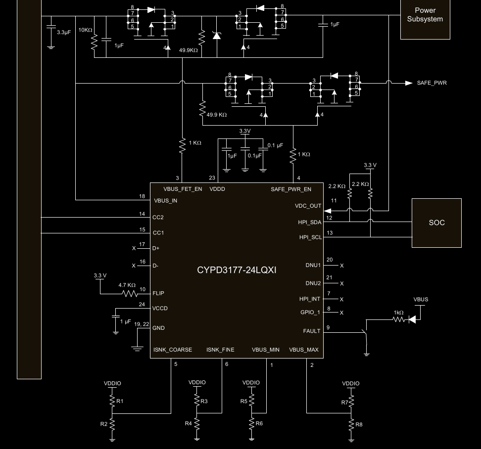
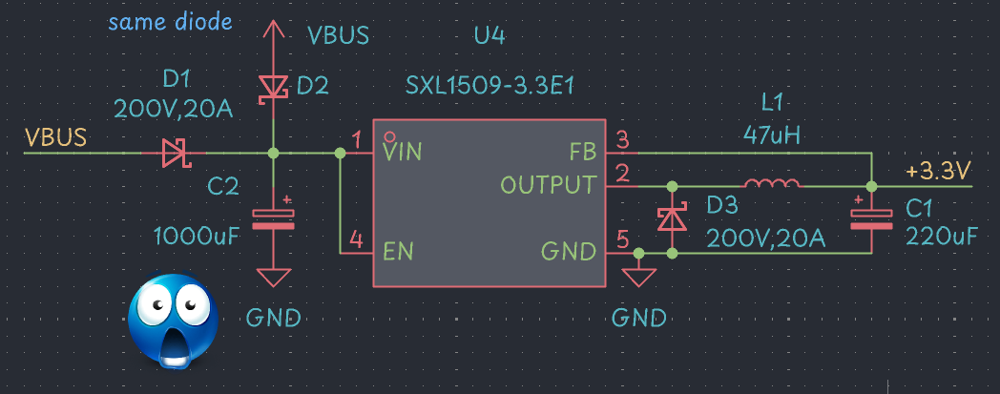
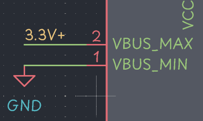
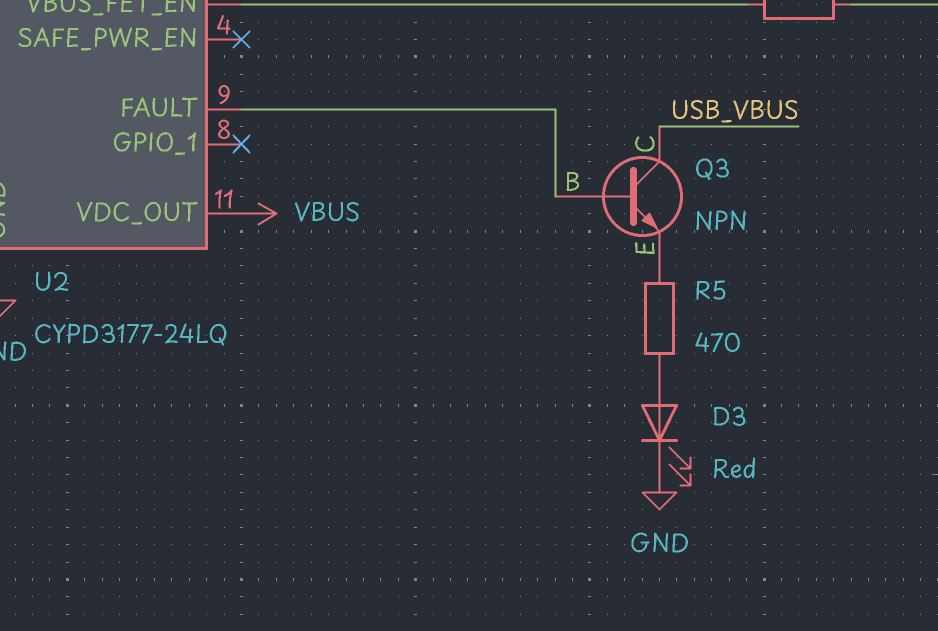
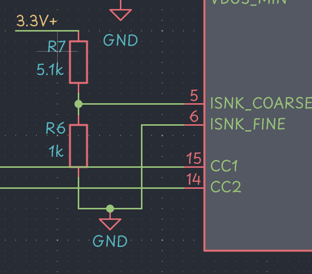
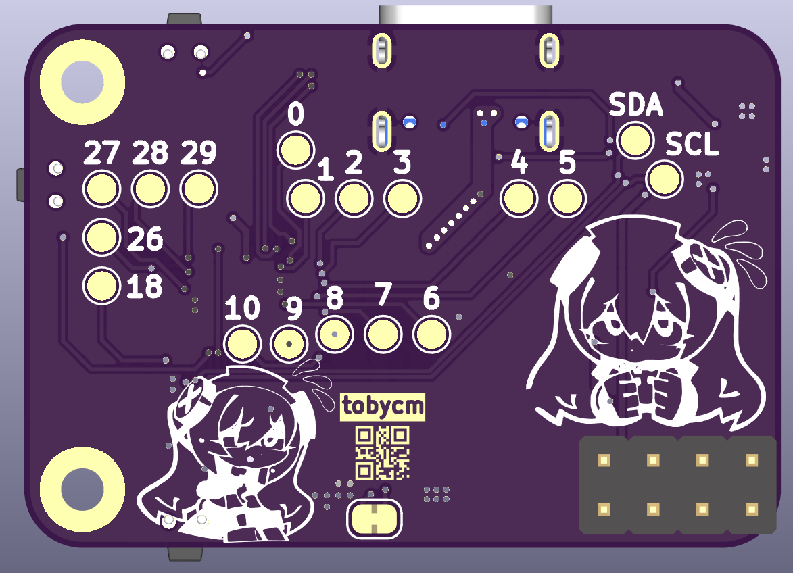

# Raspberry Pi Power Hub

## Jun 25, 2025 | 12:00 - 16:00 | Init

since i made devices with usb c pd stuff before, im going with cypd3175 and cypd3177 ICs for this :3

https://g.co/gemini/share/f052dd489182

i love gemini, lots of good researching and i can just compare and decide

after lots of consulting, i ended up with:

- 4 cypd3175 ics, for a total of 4 usb c and 4 usb a ports
- 1 cypd3177 ic
- 1 rp2040 ic for the main brain of the device 🔥🔥🔥

time to research for parts on lcsc, and wire them up in kicad

- usb c receptacle: [https://lcsc.com/product-detail/USB-Connectors_G-Switch-GT-USB-7010AN_C963370.html](https://lcsc.com/product-detail/USB-Connectors_G-Switch-GT-USB-7010AN_C963370.html)
- cypd3175: [https://lcsc.com/product-detail/USB-Converters_Infineon-Cypress-Semicon-CYPD3175-24LQXQT_C2952419.html](https://lcsc.com/product-detail/USB-Converters_Infineon-Cypress-Semicon-CYPD3175-24LQXQT_C2952419.html)
- cypd3177: [https://lcsc.com/product-detail/Power-Management-Specialized_Infineon-Technologies-CYPD3177-24LQXQT_C5904158.html](https://lcsc.com/product-detail/Power-Management-Specialized_Infineon-Technologies-CYPD3177-24LQXQT_C5904158.html)
- buck converter: [https://lcsc.com/product-detail/DC-DC-Converters_Tokmas-TPS54561DPRR-TOKMAS_C7589231.html](https://lcsc.com/product-detail/DC-DC-Converters_Tokmas-TPS54561DPRR-TOKMAS_C7589231.html)
- rp2040: [https://lcsc.com/product-detail/Microcontrollers-MCU-MPU-SOC_Raspberry-Pi-RP2040_C2040.html](https://lcsc.com/product-detail/Microcontrollers-MCU-MPU-SOC_Raspberry-Pi-RP2040_C2040.html)

## 21:00 - 22:50 | copied rp2040 wiring from previous board

with the new diode and no more latching button xd.

lots of time spent on finding parts on LCSC

## Jun 29, 2025 | 17:15 - 21:45 | wiring up cypd3177 and fix up rp2040

the datasheet reference schematic is the best place to start, as they have values that the manufacturer tested and recommends.

after some questions and answers with Google Gemini, i learned that:

- the 2 mosfets facing each other are for reverse current protection, if this device is disconnected from the power source, it will not allow current to flow back into the power source, causing undefined behavior.
- safe_pwr always provides 5V, so that is nice to power microcontrollers and other devices that need 5V always on.
- table 2, 3, and 4 in the datasheet helps with choosing resistor values to set the desired voltage range and min current limit.

after a bit more chatting with Google Gemini:

- trying to optimize for efficiency: we went with a better buck converter than the XXL1509-5.0 with 83% for a Silergy brand buck converter, which has ~92% efficiency. a lot better.

because the cypd3175 can support an additional 5V usb output, i will supply 2 type a port with the Silergy 6A 5V buck converter

too much shopping, i should start wiring this up in kicad 💀

literally peak

## Jul 19, 2025 | 16:00 - 20:00 | finishing wiring up cypd3177

small life update: i got a new job :D downside is i have less time to work on this project :C

apparently lots of MOSFETs have max Vgs of 20V, so i had to find a zener diode to clamp the gate voltage to 18V, so that the MOSFETs don't get damaged.

to request 5V min and 20V max

added a fault indicator LED :D

to request at least 1A of current :D

## Jul 20, 2025 | 12:00 - 18:00 | laying out the board

i think i will make smaller cypd3175 modules, so this board will only have the cypd3177 and rp2040, and the buck converter for 3.3V

FINALLY DONE WOOHOO! time to add a bunch of art and make it look nice :D

## Jul 26, 2025 | 13:20 - 15:00 | im cooked

i just realized that my via size is too small, so i have to fix all of that 😭😭😭😭😭😭

oof

also i forgot that this is meant to be kinda like a breakout, and i forgot to breakout the power outputs 💀💀

lets gooooooooo

pinouts added too! done!