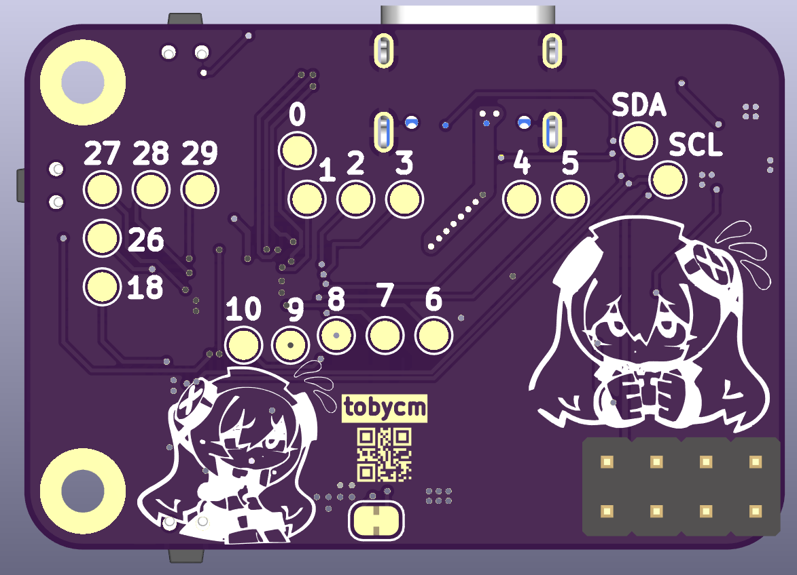

# RP2040 + CYPD3177 Power Hub

one port (usb c) to rule them all!!! this board is designed to take a single USB-C input and negociate for your power needs. it can output 5v, 9v, 12v, or 20v at up to 3A. the usb c port is also connected to a RP2040 if you want more processing with the CYPD3177 through HPI.

## 3D render

## BOM

| Part Name | Quantity | Link |
| :--- | :---: | :--- |
| PCB | 1 | [JLCPCB](https://jlcpcb.com) |
| Stencil | 1 | [JLCPCB](https://jlcpcb.com) |
| RP2040 | 1 | [C2040](https://lcsc.com/product-detail/C2040.html) |
| CYPD3177-24LQ | 1 | [C5904158](https://lcsc.com/product-detail/C5904158.html) |
| W25Q32JVSS | 1 | [C82344](https://lcsc.com/product-detail/C82344.html) |
| GT-USB-7010AN | 1 | [C963370](https://lcsc.com/product-detail/C963370.html) |
| ABM8-272-T3\_C20625731 | 1 | [C20625731](https://lcsc.com/product-detail/C20625731.html) |
| TS24CA | 3 | [C393942](https://lcsc.com/product-detail/C393942.html) |
| AP63203WU-7 | 1 | [C780769](https://lcsc.com/product-detail/C780769.html) |
| Zener Diode | 2 | [C82088](https://lcsc.com/product-detail/C82088.html) |
| NPN | 1 | [C5338312](https://lcsc.com/product-detail/C5338312.html) |
| AOD409-HXY | 2 | [C6285771](https://lcsc.com/product-detail/C6285771.html) |
| Green Led | 2 | [C7496818](https://lcsc.com/product-detail/C7496818.html) |
| Amber Led | 2 | [C165983](https://lcsc.com/product-detail/C165983.html) |
| Red Led | 3 | [C965799](https://lcsc.com/product-detail/C965799.html) |
| 18pF | 2 | [C106202](https://lcsc.com/product-detail/C106202.html) |
| 100nF | 12 | [C60474](https://lcsc.com/product-detail/C60474.html) |
| 10uF | 3 | [C2762594](https://lcsc.com/product-detail/C2762594.html) |
| 1uF | 6 | [C1592](https://lcsc.com/product-detail/C1592.html) |
| 4.7uF | 1 | [C51205](https://lcsc.com/product-detail/C51205.html) |
| 4.7uH | 1 | [C41413058](https://lcsc.com/product-detail/C41413058.html) |
| 470ohm | 7 | [C25117](https://lcsc.com/product-detail/C25117.html) |
| 49.9kohm | 1 | [C25897](https://lcsc.com/product-detail/C25897.html) |
| 4.7kohm | 1 | [C25900](https://lcsc.com/product-detail/C25900.html) |
| 5.1kohm | 1 | [C25905](https://lcsc.com/product-detail/C25905.html) |
| 10kohm | 1 | [C60490](https://lcsc.com/product-detail/C60490.html) |
| 1kohm | 5 | [C106235](https://lcsc.com/product-detail/C106235.html) |
| 27ohm | 2 | [C138021](https://lcsc.com/product-detail/C138021.html) |
| Pin Headers | 1 | [C7501275](https://lcsc.com/product-detail/C7501275.html) |
| | |
| Total cost | 74.24 USD LCSC + 13.98 USD JLCPCB = 88.22 USD | |
| Soldering paste (cheaper than PCBA) | 1 | https://amazon.ca/dp/B0BLSJQPR6 |
| Total cost with soldering paste | 88.22 USD + 19.59 CAD = 102.43 USD | |
